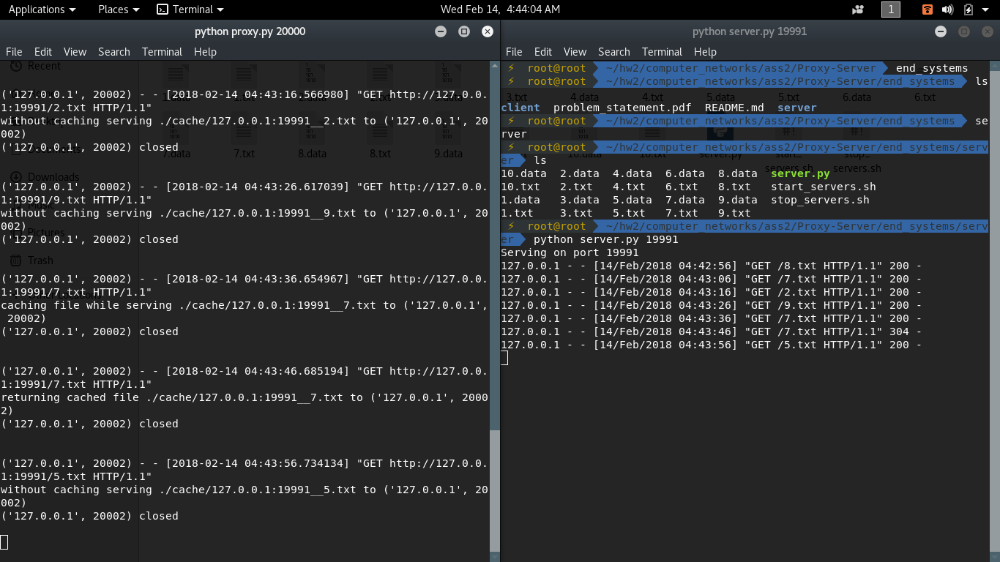
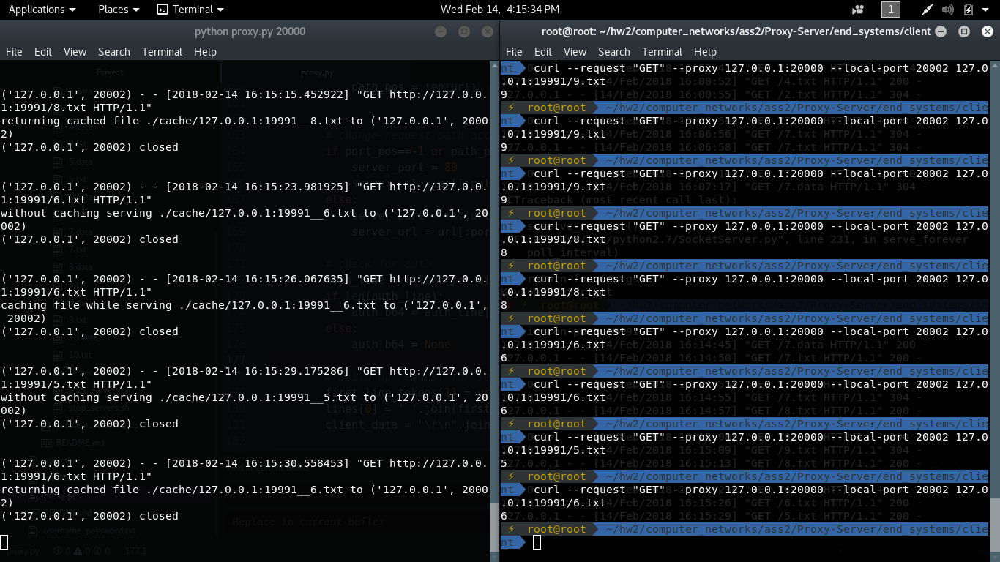
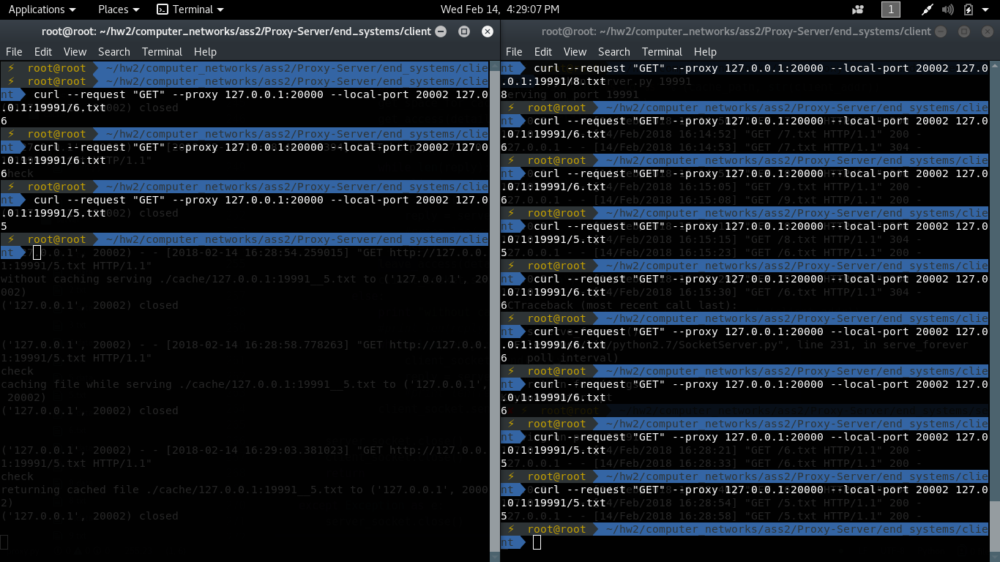

# Assignment 2 - Proxy Server
An HTTP proxy server implemented via python socket programming with caching

## Authors
1. Sayak Kundu - 20161035
2. Akshat Maheshwari - 20161024

## State Diagram for Proxy Server

## Description
- `proxy.py` is the main proxy file
- Proxy runs on some specific ports, some ports are reserved for clients and some for servers
- `end_systems` folder contains the server and the client codes
	- Client keeps asking any file [1-10].txt/txt from server by GET or POST method
	- Server listens to specified port and serves any file as asked
- Proxy works as middleman between the server and client and it does caching, authentication, etc
- Only GET and POST requests are handled

## Features
- Receives the request from client and pass it to the server after necessary parsing
- Threaded proxy server thus able to handle many requests at the same time
- If one file is requested above the threshold number of times in certain time period, then proxy server caches that request. The threshold number and time limit can be set by changing global constants in *proxy.py* file
- To maintain integrity, cached files are accessed by securing mutex locks
- Cache has limited size, so if the cache is full and proxy wants to store another response then it removes the least recently asked cached response. Cache limit can be set by setting up the constant in *proxy.py* file

## How to run

#### Proxy
- Specify proxy port while running proxy
	`python proxy.py 20000`
	It will run proxy on port 20000

#### Server
- run server in *end_systems/server/* directory

- `python server.py 19991` to run server on port 19991

#### Client
- curl request can be sent as client request and get the response.  
`curl --request GET --proxy 127.0.0.1:20000 --local-port 20002 127.0.0.1:19991/1.txt`  
this request will ask 1.txt file from server 127.0.0.1/19991 by GET request via proxy 127.0.0.1/20000

- client script which randomly asks any file from any server is provided in *end_systems/client/*

	`python client.py 20002 20000 19991`  
	this will run a client which asks, after every 10 seconds, any file from server at 19991, using any port 20002, via proxy at port 20000

- see the changes in cache directory.

- `bash scripts can be used to initialize and imitate multiple servers and clients easily`

## Screenshots

- Proxy and Server

- Individual curl requests from client

- Multiple Clients

